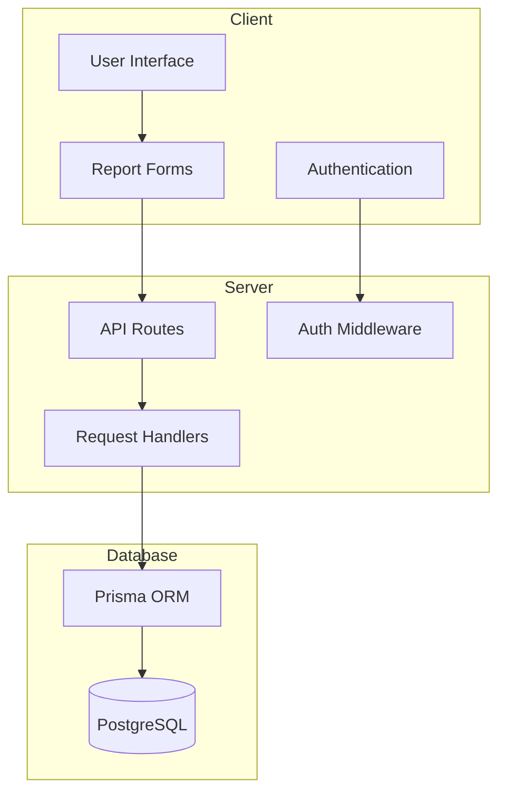
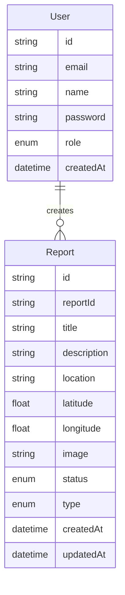
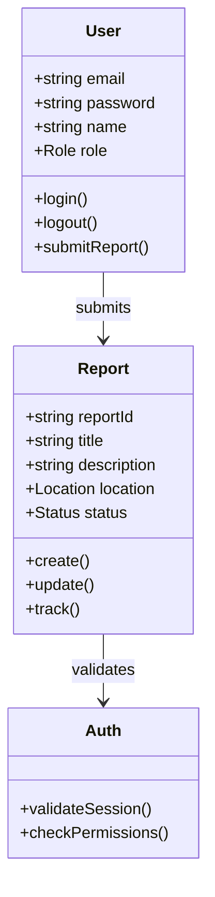

# Apaat Report

A secure and anonymous incident reporting platform built with Next.js and TypeScript. It enables users to submit reports with image analysis and geolocation support while maintaining anonymity.

## Table of Contents

- [Features](#features)
- [System Architecture](#system-architecture)
- [Technology Stack](#technology-stack)
- [Installation](#installation)
- [Database Schema](#database-schema)
- [Application Flow](#application-flow)
- [API Documentation](#api-documentation)
- [Contributing](#contributing)

## Features

- 🔒 Anonymous Report Submission
- 📍 Geolocation Integration
- 🖼️ Image Analysis and Upload
- 🔍 Report Tracking System
- 👥 Role-based Access Control
- 🔐 Secure Authentication
- 📱 Responsive Design

## System Architecture



## Database Schema



## Application Flow



## Technology Stack

- **Frontend:**

  - Next.js 15
  - TypeScript
  - TailwindCSS
  - ShadCN UI
  - NextAuth.js

- **Backend:**

  - Node.js
  - Prisma ORM
  - PostgreSQL
  - NextAuth.js

- **DevOps:**
  - Vercel Deployment
  - Docker
  - Nginx
  - GitHub Actions
  - ESLint
  - Prettier

## Installation

1. **Clone the repository:**

```bash
git clone https://github.com/yourusername/apaat-report.git
cd apaat-report
```

2. **Install dependencies:**

```bash
npm install
```

3. **Set up environment variables:**
   Create a `.env.local` file:

```env
DATABASE_URL="postgresql://..."
NEXTAUTH_SECRET="your-secret"
NEXTAUTH_URL="http://localhost:3000"
```

4. **Run database migrations:**

```bash
npx prisma migrate dev
```

5. **Start the development server:**

```bash
npm run dev
```

## API Documentation

### Authentication Routes

- `POST /api/auth/signup`: Create new user account
- `POST /api/auth/[...nextauth]`: Handle authentication

### Report Routes

- `POST /api/reports/create`: Submit new report
- `GET /api/reports`: Get all reports
- `GET /api/reports/:id`: Get specific report
- `PUT /api/reports/:id`: Update report status

## Project Structure

```
apaat-report/
├── app/                    # Next.js 13+ app directory
│   ├── api/               # API routes
│   ├── (auth)/           # Authentication pages
│   └── (dashboard)/      # Admin dashboard pages
├── components/            # Reusable React components
├── lib/                   # Utility functions and configs
├── prisma/               # Database schema and migrations
└── public/               # Static assets
```

## Contributing

1. Fork the repository
2. Create your feature branch (`git checkout -b feature/AmazingFeature`)
3. Commit your changes (`git commit -m 'Add some AmazingFeature'`)
4. Push to the branch (`git push origin feature/AmazingFeature`)
5. Open a Pull Request

## License

This project is licensed under the MIT License - see the [LICENSE](LICENSE) file for details.
